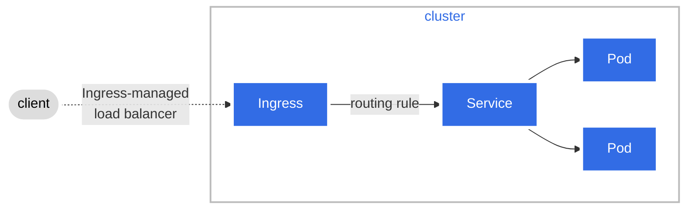
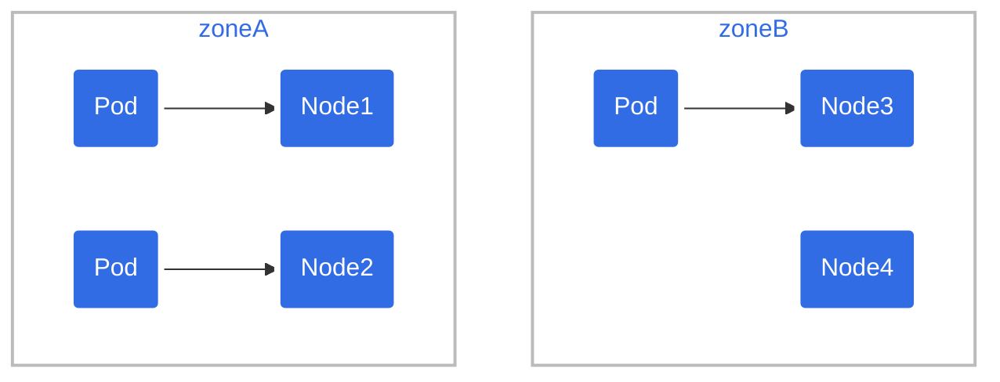

By Chris Metz and Tim Bannister

---

Topics covered in this blog.



<!--- added padding to align text with diagram above --->
<p style="padding-left: 200px; font-weight: bold"><a href="https://mermaid-js.github.io/mermaid-live-editor/edit/#eyJjb2RlIjoiJSV7aW5pdDp7XCJ0aGVtZVwiOlwibmV1dHJhbFwifX0lJVxuZmxvd2NoYXJ0IExSXG4gICAgQltXaHkgYXJlIGRpYWdyYW1zPGJyPnVzZWZ1bCBmb3IgZG9jdW1lbnRhdGlvbj9dIC0tPiBDW1VzZSBNZXJtYWlkLmpzXVxuICAgIEMgLS0-IERbRXhhbXBsZXNdXG5cbiAgICAiLCJtZXJtYWlkIjoie1xuICBcInRoZW1lXCI6IFwiZGVmYXVsdFwiXG59IiwidXBkYXRlRWRpdG9yIjpmYWxzZSwiYXV0b1N5bmMiOnRydWUsInVwZGF0ZURpYWdyYW0iOmZhbHNlfQ">Live editor link: Topics Covered</a></p>

---

## Why are diagrams useful for documentation?

* **Friendly landing spot**. Greeting readers with a page full of text can be intimidating to those new to Kubernetes, software engineering and tech writing.

* **Faster grasp of concepts.** A diagram can serve as a visual roadmap for details covered in the accompanying text.

* **Better retention.** Humans remember pictures better than words.

Most importantly, readers **acquire the confidence to explore further**. "Wow! Okay I get this. What's next? Maybe I can contribute."

There are many drawing tools to choose from. Traditionally, you create a diagram, save it as png or svg file and then embed the file in the documentation. This takes time, skills vary, and complicates collaboration between contributors and reviewers.

What if we told you there is a package that allows you to generate simple diagrams using a Markdown-like syntax?

---

## Mermaid.js

[Mermaid](https://mermaid-js.github.io/mermaid/#/) is a package for generating diagrams using markdown-ish text in markdown files. Here are some of the features we love about Mermaid:

* **Inline code syntax** you can copy into the page markdown. Indeed, you should treat Mermaid code as documentation text subject to the usual PR processes. 

* **[On-line live editor](https://mermaid-js.github.io/mermaid-live-editor)** to dynamically create and edit diagrams. The live editor displays the code and the rendered diagram. __TIP: You should always use the live editor to draw diagrams.__

* **Share diagram URLs**. The live editor generates a URL for each saved diagram. You can share this link with colleagues to collaborate on diagram creation and editing.

* **Generate svg image files**. If your site doesn't support Mermaid, but can handle svg image files as most do, then just ask the live editor to generate an svg file. __HINT: we use svg files in this blog because the contributor-site does not support Mermaid.__

You can choose from different formats including flowchart, sequence and state.
The main [Kubernetes website](https://kubernetes.io/) is set up so that Mermaid works out of the box.

The Mermaid documentation is excellent - simple text, multiple examples and diagrams included!

---

## What do I need to start using Mermaid?

You need your favorite markdown editor, live editor access and familiarity with Hugo. 

## Examples

The first diagram is shown in [What is Ingress?](https://kubernetes.io/docs/concepts/services-networking/ingress/#what-is-ingress)



<p style="text-align: center; font-weight: bold"><a href="https://mermaid-js.github.io/mermaid-live-editor/edit/#eyJjb2RlIjoiZ3JhcGggIExSXG4gIGNsaWVudChbY2xpZW50XSktLiBJbmdyZXNzLW1hbmFnZWQgPGJyPiBsb2FkIGJhbGFuY2VyIC4tPmluZ3Jlc3NbSW5ncmVzc107XG4gIGluZ3Jlc3MtLT58cm91dGluZyBydWxlfHNlcnZpY2VbU2VydmljZV07XG4gIHN1YmdyYXBoIGNsdXN0ZXJcbiAgaW5ncmVzcztcbiAgc2VydmljZS0tPnBvZDFbUG9kXTtcbiAgc2VydmljZS0tPnBvZDJbUG9kXTtcbiAgZW5kXG4gIGNsYXNzRGVmIHBsYWluIGZpbGw6I2RkZCxzdHJva2U6I2ZmZixzdHJva2Utd2lkdGg6NHB4LGNvbG9yOiMwMDA7XG4gIGNsYXNzRGVmIGs4cyBmaWxsOiMzMjZjZTUsc3Ryb2tlOiNmZmYsc3Ryb2tlLXdpZHRoOjRweCxjb2xvcjojZmZmO1xuICBjbGFzc0RlZiBjbHVzdGVyIGZpbGw6I2ZmZixzdHJva2U6I2JiYixzdHJva2Utd2lkdGg6MnB4LGNvbG9yOiMzMjZjZTU7XG4gIGNsYXNzIGluZ3Jlc3Msc2VydmljZSxwb2QxLHBvZDIgazhzO1xuICBjbGFzcyBjbGllbnQgcGxhaW47XG4gIGNsYXNzIGNsdXN0ZXIgY2x1c3RlcjtcbiIsIm1lcm1haWQiOiJ7XG4gIFwidGhlbWVcIjogXCJkZWZhdWx0XCJcbn0iLCJ1cGRhdGVFZGl0b3IiOmZhbHNlLCJhdXRvU3luYyI6dHJ1ZSwidXBkYXRlRGlhZ3JhbSI6ZmFsc2V9">Live editor link: What is Ingress?</a></p>

Code:



---
<br>

Did you notice that some of the diagram elements are colored blue? That is accomplished using a `classDef` statement to define a class of style attributes, and a `class` statement to apply that style to those elements.

In the code for the diagram above, we have examples of both: 
```
classDef k8s fill:#326ce5,stroke:#fff,stroke-width:4px,color:#fff; // defines style for the k8s class
class ingress,service,pod1,pod2 k8s; // k8s class is applied to elements ingress, service, pod1 and pod2.
```

You can even style an individual element in your diagram using the style statement.
```mermaid
style box1 fill:#FF0000,stroke:333,stroke-width:3px // applies style to box1
```

---
<br>

The next diagram appears in [Pod Topology Spread Constraints](https://kubernetes.io/docs/concepts/workloads/pods/pod-topology-spread-constraints/#example-one-topologyspreadconstraint).



<!--- added padding to align text with diagram above --->
<p style="padding-left: 60px; font-weight: bold"><a href="https://mermaid-js.github.io/mermaid-live-editor/edit/#eyJjb2RlIjoiZ3JhcGggIEJUXG4gICAgc3ViZ3JhcGggXCJ6b25lQlwiXG4gICAgICAgIHAzKFBvZCkgLS0-IG4zKE5vZGUzKVxuICAgICAgICBuNChOb2RlNClcbiAgICBlbmRcbiAgICBzdWJncmFwaCBcInpvbmVBXCJcbiAgICAgICAgcDEoUG9kKSAtLT4gbjEoTm9kZTEpXG4gICAgICAgIHAyKFBvZCkgLS0-IG4yKE5vZGUyKVxuICAgIGVuZFxuXG4gICAgY2xhc3NEZWYgcGxhaW4gZmlsbDojZGRkLHN0cm9rZTojZmZmLHN0cm9rZS13aWR0aDo0cHgsY29sb3I6IzAwMDtcbiAgICBjbGFzc0RlZiBrOHMgZmlsbDojMzI2Y2U1LHN0cm9rZTojZmZmLHN0cm9rZS13aWR0aDo0cHgsY29sb3I6I2ZmZjtcbiAgICBjbGFzc0RlZiBjbHVzdGVyIGZpbGw6I2ZmZixzdHJva2U6I2JiYixzdHJva2Utd2lkdGg6MnB4LGNvbG9yOiMzMjZjZTU7XG4gICAgY2xhc3MgbjEsbjIsbjMsbjQscDEscDIscDMgazhzO1xuICAgIGNsYXNzIHpvbmVBLHpvbmVCIGNsdXN0ZXI7XG4iLCJtZXJtYWlkIjoie1xuICBcInRoZW1lXCI6IFwiZGVmYXVsdFwiXG59IiwidXBkYXRlRWRpdG9yIjpmYWxzZSwiYXV0b1N5bmMiOnRydWUsInVwZGF0ZURpYWdyYW0iOnRydWV9">Live editor link: Pod Topology Spread Constraints</a></p>

Code:


---
<br>

A [recent talk at Kubecon](https://www.youtube.com/watch?v=X40LJM0KuQ8) suggested the use of sequence diagrams to describe the interactions between different components in the control plane and nodes. Here is an example illustrating the system flow starting with a `kubectl apply` command and ending with container startup on the node.




<p style="text-align: center; font-weight: bold"><a href="https://mermaid-js.github.io/mermaid-live-editor/edit/#eyJjb2RlIjoiJSV7aW5pdDp7XCJ0aGVtZVwiOlwibmV1dHJhbFwifX0lJVxuc2VxdWVuY2VEaWFncmFtXG4gICAgYWN0b3IgbWVcbiAgICBwYXJ0aWNpcGFudCBhcGlTcnYgYXMgY29udHJvbCBwbGFuZTxicj48YnI-YXBpLXNlcnZlclxuICAgIHBhcnRpY2lwYW50IGV0Y2QgYXMgY29udHJvbCBwbGFuZTxicj48YnI-ZXRjZCBkYXRhc3RvcmVcbiAgICBwYXJ0aWNpcGFudCBjbnRybE1nciBhcyBjb250cm9sIHBsYW5lPGJyPjxicj5jb250cm9sbGVyPGJyPm1hbmFnZXJcbiAgICBwYXJ0aWNpcGFudCBzY2hlZCBhcyBjb250cm9sIHBsYW5lPGJyPjxicj5zY2hlZHVsZXJcbiAgICBwYXJ0aWNpcGFudCBrdWJlbGV0IGFzIG5vZGU8YnI-PGJyPmt1YmVsZXRcbiAgICBwYXJ0aWNpcGFudCBjb250YWluZXIgYXMgbm9kZTxicj48YnI-Y29udGFpbmVyPGJyPnJ1bnRpbWVcbiAgICBtZS0-PmFwaVNydjogMS4ga3ViZWN0bCBjcmVhdGUgLWYgcG9kLnlhbWxcbiAgICBhcGlTcnYtLT4-ZXRjZDogMi4gc2F2ZSBuZXcgc3RhdGVcbiAgICBjbnRybE1nci0-PmFwaVNydjogMy4gY2hlY2sgZm9yIGNoYW5nZXNcbiAgICBzY2hlZC0-PmFwaVNydjogNC4gd2F0Y2ggZm9yIHVuYXNzaWduZWQgcG9kcyhzKVxuICAgIGFwaVNydi0-PnNjaGVkOiA1LiBub3RpZnkgYWJvdXQgcG9kIHcgbm9kZW5hbWU9XCIgXCJcbiAgICBzY2hlZC0-PmFwaVNydjogNi4gYXNzaWduIHBvZCB0byBub2RlXG4gICAgYXBpU3J2LS0-PmV0Y2Q6IDcuIHNhdmUgbmV3IHN0YXRlXG4gICAga3ViZWxldC0-PmFwaVNydjogOC4gbG9vayBmb3IgbmV3bHkgYXNzaWduZWQgcG9kKHMpXG4gICAgYXBpU3J2LT4-a3ViZWxldDogOS4gYmluZCBwb2QgdG8gbm9kZVxuICAgIGt1YmVsZXQtPj5jb250YWluZXI6IDEwLiBzdGFydCBjb250YWluZXJcbiAgICBrdWJlbGV0LT4-YXBpU3J2OiAxMS4gdXBkYXRlIHBvZCBzdGF0dXNcbiAgICBhcGlTcnYtLT4-ZXRjZDogMTIuIHNhdmUgbmV3IHN0YXRlIiwibWVybWFpZCI6IntcbiAgXCJ0aGVtZVwiOiBcImRlZmF1bHRcIlxufSIsInVwZGF0ZUVkaXRvciI6ZmFsc2UsImF1dG9TeW5jIjp0cnVlLCJ1cGRhdGVEaWFncmFtIjp0cnVlfQ">Live editor link: K8s System Flow Sequence Diagram</a></p>


Code:

```mermaid
%%{init:{"theme":"neutral"}}%% // init directive for theme
sequenceDiagram
    actor me
    participant apiSrv as control plane<br><br>api-server
    participant etcd as control plane<br><br>etcd datastore
    participant cntrlMgr as control plane<br><br>controller<br>manager
    participant sched as control plane<br><br>scheduler
    participant kubelet as node<br><br>kubelet
    participant container as node<br><br>container<br>runtime
    me->>apiSrv: 1. kubectl create -f pod.yaml
    apiSrv-->>etcd: 2. save new state
    cntrlMgr->>apiSrv: 3. check for changes
    sched->>apiSrv: 4. watch for unassigned pods(s)
    apiSrv->>sched: 5. notify about pod w nodename=" "
    sched->>apiSrv: 6. assign pod to node
    apiSrv-->>etcd: 7. save new state
    kubelet->>apiSrv: 8. look for newly assigned pod(s)
    apiSrv->>kubelet: 9. bind pod to node
    kubelet->>container: 10. start container
    kubelet->>apiSrv: 11. update pod status
    apiSrv-->>etcd: 12. save new state
```

---

Mermaid provides a simple, open and transparent tool for the community to add, edit and collaborate on diagrams for new or existing documentation. 

We hope this blog inspires you to create and include diagrams in your documentation. New and experienced readers and contributors will thank you.

Mermaid rocks!!