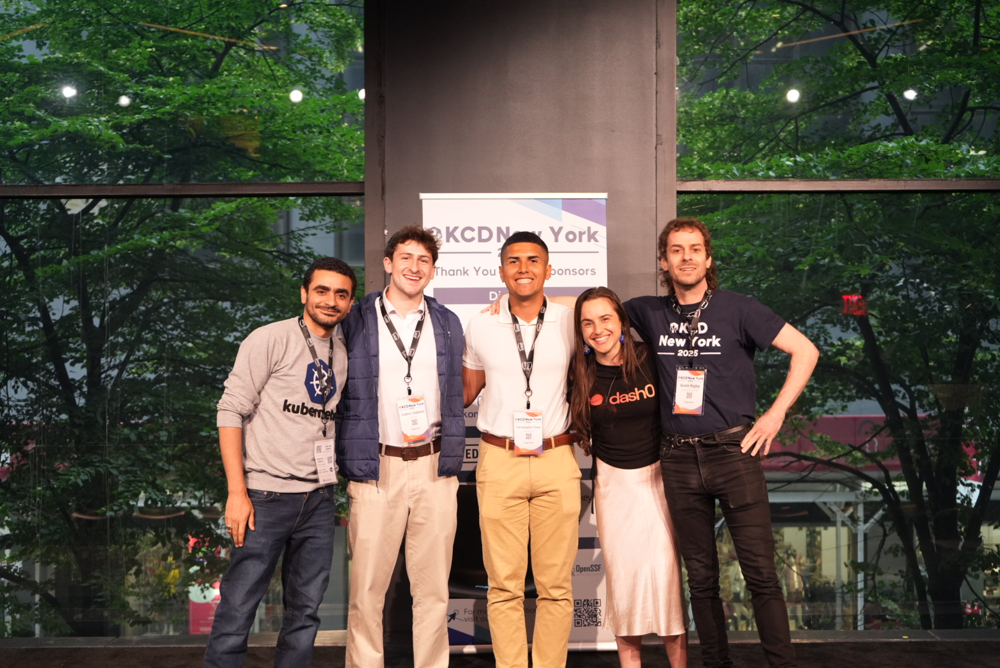
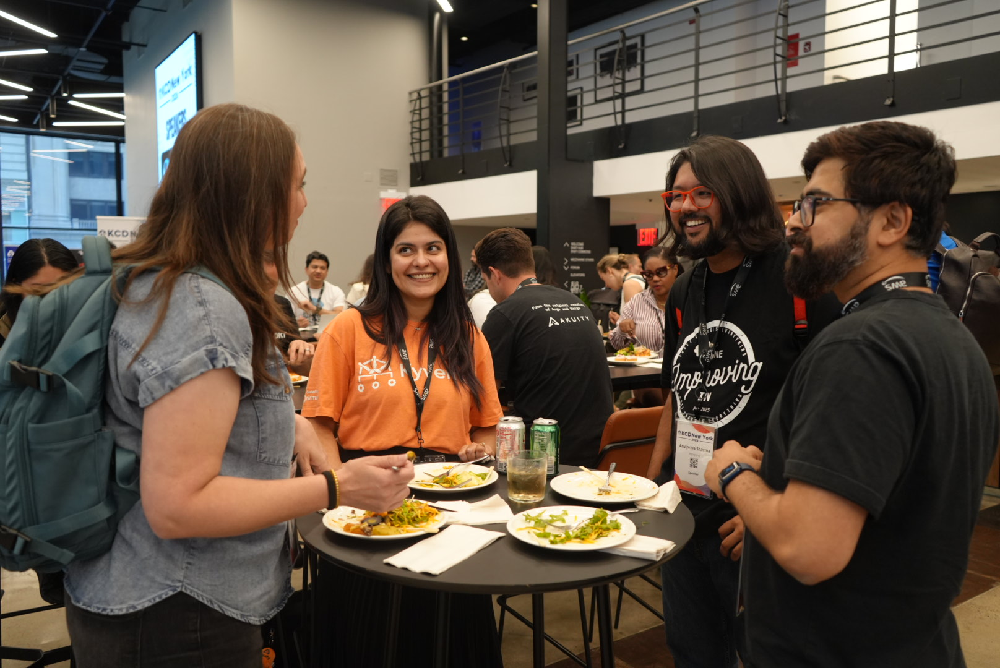
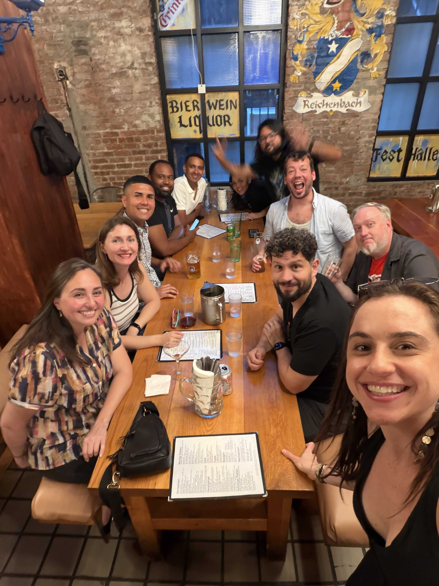

Welcome to KCD Around the World, a new series where we explore Kubernetes Community Days from every corner of the globe. When most people think of KCD, they think about talks and technical sessions, but behind every event is a community of volunteers, contributors, organizers and attendees who make it all happen. Through conversations with the people behind each KCD, we'll share what makes it unique.

Our first stop: New York City.

We caught up with the KCD New York team to learn what made this year's event special.

## Picture-1 

## Picture-2 

## Picture-3

