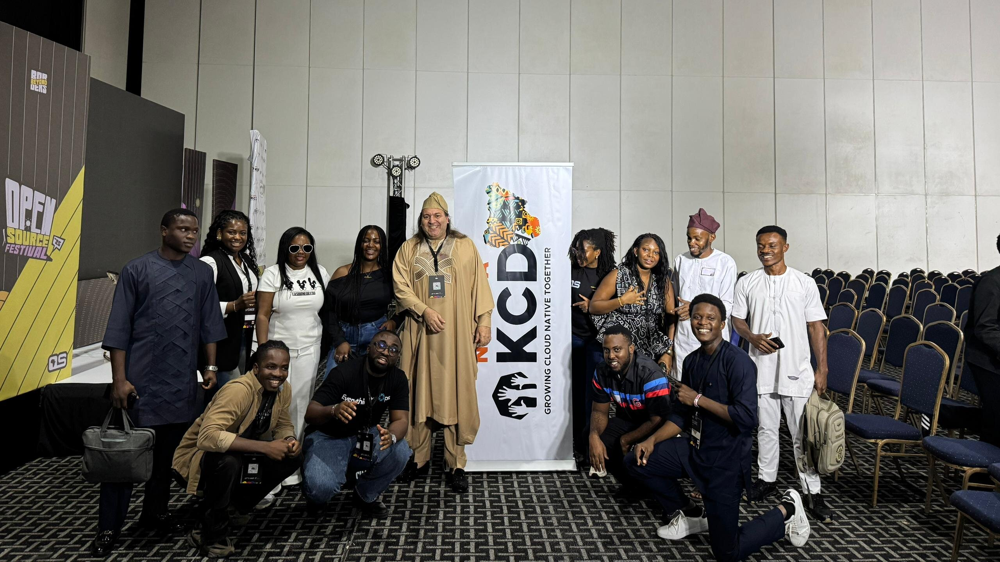
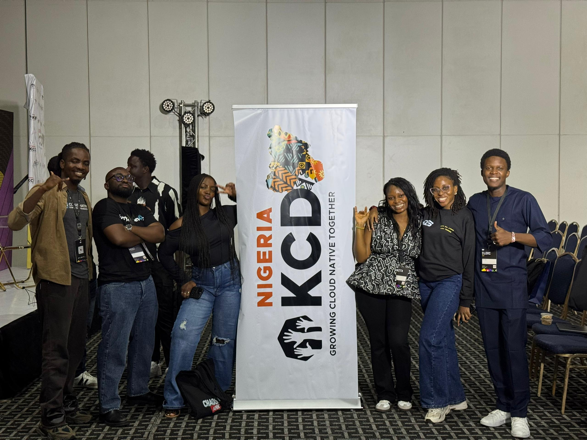

Welcome back to KCD Around the World, a series where we explore [Kubernetes Community Days](https://www.cncf.io/kcds/) from every corner of the globe. Behind every event is a community of volunteers, contributors, organizers and attendees who make it all happen. Through conversations with the people behind each KCD, we share what makes it unique.

This stop: Nigeria. KCD Nigeria started back in 2021 as KCD Africa, the first Kubernetes Community Days on the continent. On October 24, 2026, the community comes together at Zone Tech Park in Gbagada, Lagos, for its fourth edition, themed ["Telling the African Cloud Native Story"](https://community2.cncf.io/events/details/cncf-kcd-nigeria-presents-kcd-nigeria-2026-telling-the-african-cloud-native-story/). We spoke with organizers Divine Odazie, Ileriayo Adebiyi, Somtochi Onyekwere, and Uchechukwu Obasi about how the Nigerian cloud native community has grown and where it is headed.

## Meet the community

**Destiny Erhabor (DE):** Could you each introduce yourselves and tell us how you got involved in Kubernetes?

**Divine Odazie (DO):** I'm a CNCF Ambassador, founder of EverythingDevOps, and a program committee member for Platform Engineering Day North America 2026. As a developer advocate, I help cloud native vendors build better end-user tools and infrastructure. I've contributed to Kubernetes, Cilium, and other projects, and I've given talks and workshops at KubeCon North America, Open Source Summit Europe, Kubernetes Community Days, and Ansible Contributor Summit.

My journey in Kubernetes started in 2021, after working with Docker and Docker Compose at an e-commerce startup. I heard about Kubernetes at an open source conference where Chris Aniszczyk spoke. He shared a Kubernetes and Cloud Native Associate (KCNA) voucher, which I used to take and pass the exam. Five years later, I hold four certifications, I'm a CNCF Ambassador, I've organized a KCD, attended several KubeCons, and worked on Data on Kubernetes, platform engineering, and much more.

**Ileriayo Adebiyi (IA):** I used to work as an IT engineer. I handled everything the developers couldn't, from managing servers to helping get their apps into production. As we scaled, logging into servers and deploying multiple services across them by hand became very tedious. A teammate introduced me to Kubernetes, and it seemed to solve exactly the problems I was facing. From that point, I began to learn Kubernetes and to teach it. Teaching helped me solidify the concepts through repetition.

Before all that, I'd done a bit of everything: I fixed computers, worked on hardware, software, and networks, and even climbed masts to fix internet connections.

**Somtochi Onyekwere (SO):** My Kubernetes journey started with Google Summer of Code (GSoC). I was aiming to get into GSoC in 2020, so earlier that year I started contributing to Kubernetes, to the Cluster Addons subproject of SIG Cluster Lifecycle. I got into GSoC that year, which helped me contribute even more. I've also worked on Flux, the CNCF GitOps project that came out of Weaveworks.

Getting into Kubernetes really accelerated my career. Through my mentors, who were also Kubernetes contributors, I got my first remote job. I currently work as a software engineer at Fly.io, an infrastructure startup.

**Uchechukwu Obasi (UO):** I'm a software engineer interested in open source and developer communities. I got my start in Kubernetes and the cloud native ecosystem through the Linux Foundation Mentorship (LFX) program, contributing to the Thanos project before expanding my work to other CNCF projects like Vitess and KEDA.

I currently work as a developer advocate at the CNCF, where I help improve technical documentation and developer experience for over 200 CNCF projects.

## How KCD Nigeria came about

**DE:** How did KCD Nigeria come about, and what motivated you to get involved in organizing it?

**UO:** I got accepted to the CNCF Ambassador program in 2020. Around the same time, I met Abubakar Ango, who was also a CNCF Ambassador. We found out we had a lot in common: the same home country, and a shared interest in growing the open source, DevSecOps, and cloud native community in Africa.

The cloud native ecosystem was exploding across Africa, creating a surge of talent focused on DevSecOps, containers, cloud computing, and Kubernetes. But with little to no local community to support them, many people were forced to chase limited scholarships to attend overseas conferences like KubeCon.

To bridge that gap, I helped design KCD Africa to spur local interest in these technologies and showcase the people and enterprises already building with them on our continent. As our community grew, the initiative evolved into KCD Nigeria, to directly represent and support the cloud native community here in Nigeria.

**DO:** I first got involved in 2022, when the event was still called KCD Africa. I had experience speaking at university meetups, and Bill Mulligan encouraged me to apply to speak at KCD Africa 2022. I did, and my talk got great feedback. That same year I met Abubakar, our earliest organizer, at Open Source Summit in Bilbao, Spain. We talked about the future of our community, and I decided to get involved. We tried to host the next KCD in 2024 but couldn't make it happen. We finally did in 2025, and in 2026 we're going even bigger.

**IA:** I was already contributing to the Kubernetes community, hosting free webinars and speaking, but as a solo engineer and on a small scale. I wanted to do more, to take it bigger and across Africa. At the time, there was no KCD Nigeria, only KCD Africa. When I learned about Kubernetes Community Days, the official community events held every year, I thought: why not? So I joined Uchechukwu and Abubakar, who were already building the community.

**SO:** I joined a bit later. I was a speaker at KCD Africa 2022, and I thought, these people are doing amazing work. It was virtual at the time, but I could see the vision: a conference for Africans in particular. Most of us were Nigerians, and I think the idea also sparked more country-specific KCDs in the region, as communities said they wanted their own.

At that point, I was also actively thinking about how to increase African participation in Kubernetes, and I'd created the #africa channel on Kubernetes Slack. At different points, we were all thinking about participation and inclusivity for Africans in the cloud native and Kubernetes communities, so it was great to join people who were already moving toward that vision.

## The Nigerian cloud native scene

**DE:** How would you describe the Kubernetes and cloud native community in Nigeria today, and how has it evolved over the years?

**DO:** The first Kubernetes Community Days in Africa, KCD Africa, was hosted by what is now KCD Nigeria in April 2021. Since then, we've hosted two more events, with our first in-person event in 2025.

KCD Nigeria 2025 drew over 460 attendees, a diverse mix of students, startups, and enterprise professionals. That turnout inspired our plans for 2026.

Since the 2025 event, five new CNCF chapters have opened across Nigeria, in Ibadan, Kaduna, Ilorin, Port Harcourt, and Ogbomoso. That more than doubled the three chapters that existed before. As of October 2026, there are eight CNCF chapters in Nigeria. The event also indirectly led to new chapters elsewhere in West Africa: Cloud Native Abidjan, Cloud Native Cotonou, and Cloud Native Lomé.

Our goal for KCD Nigeria 2026 is to take the cloud native community in Africa to the next level: bringing regional communities together to collaborate, learn, and grow, and to give birth to more communities, increasing talent and strengthening the CNCF's presence in Africa.

## What's new this year

**DE:** This is the fourth edition of KCD Nigeria. What has changed since you first started?

**DO:** A lot has changed. This is our second in-person event after years of being virtual. We have more speakers than ever, including international speakers from Africa, Asia, Europe, and South America. We also have more sponsors than ever, both local and international.

**SO:** We have a lot more attendees and a lot more interest. We've also started to get international notice; people are realizing that something is happening here. The international speakers are a big deal for us, because there was a time when we struggled to find speakers, and most of them were people we already knew in the community. Now we're hearing new voices, including first-time speakers. It's a great opportunity for people working in the cloud native space who never thought they could give a talk.

We also have more CNCF chapters in different states, so more meetups are happening, not only in Lagos. We've seen a lot more community involvement.

**DE:** What role do you think KCD Nigeria plays in growing and connecting the wider cloud native community in Nigeria?

**DO:** KCD Nigeria plays a pivotal role, both in Nigeria and across Africa. Many fast-growing African companies run Kubernetes, but we only hear about a few of them, and most use open source without contributing back to those projects yet.

By showing the community what's possible, KCD Nigeria builds a talent pipeline. As more of that talent contributes to open source, Africa's place in the ecosystem grows, and so does its tech economy.

**IA:** Building on what Divine said, we have the Cloud Native Community Groups, the CNCF chapters. These groups usually run on their own, with their own activities and members. KCD brings all the chapter organizers together. Instead of each group only running its own monthly or quarterly meetups, they now bring their voices together: the southwest, southeast, south-south, and the north. Everyone comes together in the same room and contributes to the growth of cloud native in Nigeria.

**SO:** Part of what we do is highlight stories and the companies using these tools, to show there's a real market in Nigeria. We've run some pilot programs where we invite people to talk about how they use Kubernetes. Showing that companies here use cloud native tools also attracts international attention, as the conference has done.

## Behind the scenes

**DE:** Are the tools and support to organize it helpful? What are the logistics behind organizing an event like this?

**DO:** The CNCF has been particularly helpful in providing support, resources, and insights, especially funding for social events. Last year we co-located with another event, but this year we're running a standalone event. That means:

- A team of more than five organizers
- A program committee with many volunteers
- Several people on the ground in Nigeria
- Working with vendors
- Scouting venues

It's a lot of moving parts and a lot of coordination. Collectively, we've put more than 1,000 hours into this event so far. We're grateful for the support of the community and our sponsors, and we're expecting the best event yet.

**IA:** The CNCF has definitely been helpful. There's a Slack channel where KCD organizers discuss the KCDs in their regions, and CNCF coordinators help with planning, reach out to sponsors, and guide us. That constant, immediate communication matters; we don't have to send an email and wait a week for a response.

Then there's the community website, where we can set up events easily. Community members can see what we're planning, RSVP directly, and get notifications and emails. For our virtual events, that was very helpful: set up the event, add your logos, and share the link. It manages attendees and check-in, and it even had built-in video streaming, so we didn't need a separate platform. For in-person events, we use a different platform for ticketing and payments.

**DE:** What do you think is the relevance of KCDs in the cloud native ecosystem?

**DO:** KCDs are very important. They're where I really got into the weeds of the ecosystem, starting with my talk at KCD Africa in 2022. That's my personal experience.

From a wider perspective, as a CNCF Ambassador who attends KCDs and contributes across different regions, I see KCDs giving many people their first opportunity to understand the cloud native ecosystem, especially in underrepresented regions like Africa, South America, and Asia. KCDs show people what's happening in the ecosystem beyond what they can find online, and let them meet the people moving the needle. That grassroots opportunity is pivotal.

Going a layer deeper, CNCF chapters, the Cloud Native Community Groups, matter just as much. You might attend a KCD once a year, but then you get involved in your local chapter regularly. KCD Nigeria 2025 spawned five new chapters in Nigeria and several collaborative chapters across Africa. That's the value of KCDs in growing the grassroots community: contributors, users, end users, vendors, and maintainers.

**DE:** What gap or need do you hope KCD Nigeria will address for the local cloud native community?

**DO:** We want to show the average Nigerian who is learning technology, learning to code, learning to write, or doing anything in the tech ecosystem that it is possible to move the needle coming from Nigeria. That's my story, and the story of many of the organizers.

That's why we do our best to keep the community alive and host this event. When you know something is possible, you can dream. And when you meet people who have done it before, you can learn the blueprint and work toward it. That's what we hope to address.

The second most important thing, and this year's theme, is telling the African story: the stories of contributors, and of organizations that use cloud native tools, all over the world. Telling the African story is about showing what's possible and our ability to dream. That's the gap we want to close.

**IA:** Many people in Nigeria and across Africa use cloud native technologies, but we're often consumers. Companies use Kubernetes internally, yet you hardly know who in Africa is using it. There's no data, so you can't build technologies that support those users in our local context. Because people don't talk about it, KCD provides a platform to tell that story, which is exactly what this year's theme is about. We get to see how these companies use these technologies in production.

We also want people to move from consuming these technologies to contributing to them: to the community, and to the tools themselves. I look at other regions, like India and elsewhere in Asia, and see people adapting tools to their own context. I hope KCD Nigeria brings people together to think through how these tools can benefit us.

In conversations about Kubernetes and cloud native, Africa often doesn't feel relevant, as if we're not a market. But we have unicorns and billion-dollar companies that use these technologies to grow, right here on this continent, and they're reaching the world. It would be great for them to show how these technologies helped them, and to contribute back.

## This year's agenda

**DE:** Can you give us a preview of this year's agenda? Are there particular themes, talks, workshops, or activities you're especially excited about?

**DO:** We have a lot of interesting talks this year, including international speakers: one from Togo, from Cloud Native Lomé, and another from Colombia. We also have Nigerian speakers working for companies in the diaspora and for local companies in Nigeria. The agenda is being published now.

One thing I want to highlight is the hackathon we're running with our sponsor Nutanix. Many people who attend events, KubeCon included, are beginners or don't have much industry experience. The hackathon helps them build connections and gain that experience.

What I'm looking forward to most is that this is our first standalone in-person event. Everyone there is there for cloud native, which creates a great opportunity for attendees to connect and build their networks. You can always watch the talks later on YouTube, but meeting people in person is one of the most valuable things I've gotten from events. My co-founder at EverythingDevOps is someone I met in person at a conference three years ago. Those opportunities are why we're committed to this event, and we're really excited.

**SO:** Personally, I'm looking forward to the technical talks. We have some deeply technical sessions that will be useful to engineers and practitioners, and I like how balanced the agenda is. There are also beginner-friendly talks for someone just learning about cloud native, or a Kubernetes user who hasn't looked under the hood yet. There's something for everybody.

As our theme says, we're telling the African cloud native story: how African and Nigerian companies use cloud native, how people here contribute to the cloud native space, and their experiences. We're spotlighting projects and research, and giving people a platform to talk about what they've been working on.

**DE:** What would you like to highlight about this year's KCD Nigeria for the wider Kubernetes community?

**IA:** This is our second in-person event, and this time we're hosting it on our own. Last year we partnered with the Open Source Community Africa Festival (OSCAFest), where most talks weren't about cloud native; we had a small corner for a few cloud native talks. This year, every talk is about cloud native. Everyone attending is a stakeholder in the cloud native ecosystem, and organizers from cloud native communities across Nigeria will be there.

KCD Nigeria was the first KCD in Africa, so for us it's like our KubeCon. Missing this event is like missing KubeCon Africa. People are flying into the country to attend, and many have asked whether they can join remotely. It's also going to be the biggest gathering of CNCF Ambassadors and Kubestronauts in Africa. Almost everybody doing big things in cloud native in Africa will be there.

**SO:** As Ileriayo said, it's the biggest cloud native gathering we have. There's no other conference like it here, so we're continuously trying to make it bigger and better, and this year is going to be different from last year. A lot of interesting things are happening in our communities, and it's worth attending for anyone working in, or interested in, the cloud native space in Nigeria.

## Looking ahead

**DE:** How can people get involved with KCD Nigeria and the wider Nigerian cloud native community?

**DO:** Anyone can [register for the event](https://edore.co/events/kcd-nigeria-2026), [join the KCD Nigeria community](https://community2.cncf.io/kcd-nigeria), and follow us on [LinkedIn](https://www.linkedin.com/company/kcd-nigeria/) and [X](https://x.com/KCDNigeria). Talks from previous editions are on YouTube: [KCD Africa 2021](https://youtube.com/playlist?list=PLj6h78yzYM2P9aHZVgJOb7WG1wyQSepwW) and [KCD Africa 2022](https://youtube.com/playlist?list=PLj6h78yzYM2MdrGMSTYEAVIRlYBfXd1K8).

**IA:** At [Cloud Native Africa](https://cloudnativeafrica.io), we're gathering cloud native stories from across the continent. Anyone can submit their story, and we can help publish it.

**SO:** Join the #africa channel on [Kubernetes Slack](https://slack.k8s.io/), and the [CNCF Slack](https://slack.cncf.io/). There's probably a CNCF chapter in a state close to you. Reach out to us with your ideas, or with work you think could add to what we're doing at KCD Nigeria. We're open to collaborating with people in this space.

**DE:** Any final words for our readers?

**DO:** Thank you so much for the opportunity to share our story. We're excited for this event.

Our goal for the next couple of years is to keep growing Africa. Africa is very diverse, with thousands of languages, different regions, and different cultures that make up its identity. We want to build an Africa that works in tandem, with a regional ecosystem that communicates.

As one of the youngest populations in the world, we are primed to contribute to technology. We have some of the smartest people, just deprived of resources. Part of our goal is to make those resources available through certifications, programs, experiences, and events like this one.

KubeCon Africa 2028, I want to say. Maybe I'm dreaming too much, but dreaming is what makes the world move and brings everything into existence.

**SO:** Thank you for the opportunity to share our story. These stories matter. When they're published and shared, that's how people outside learn about what we're doing and can help or join in. Telling our story is part of the cloud native story too.

## Next stop...

KCD Around the World continues as we visit another community and learn about the people helping Kubernetes grow around the globe.
