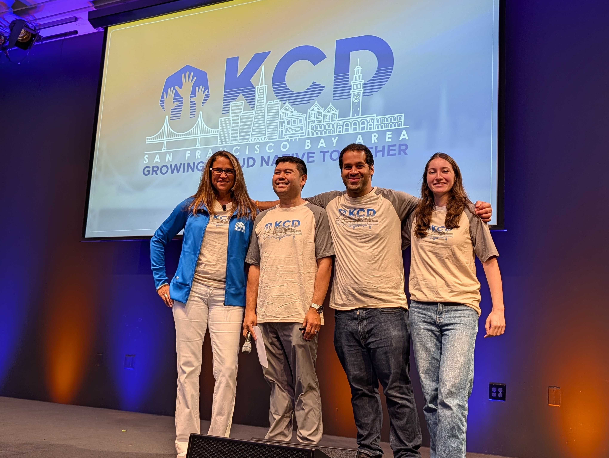
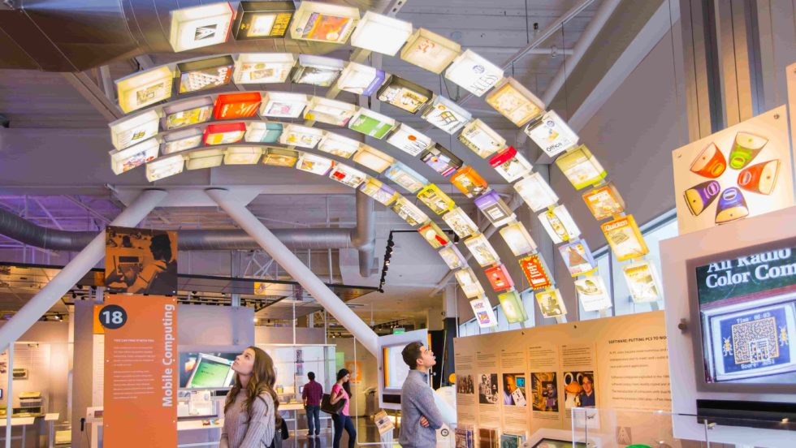

Welcome back to KCD Around the World, a series where we explore [Kubernetes Community Days](https://www.cncf.io/kcds/) from every corner of the globe. Behind every event is a community of volunteers, contributors, organizers and attendees who make it all happen. Through conversations with the people behind each KCD, we share what makes it unique.

This stop: San Francisco Bay Area. Coming up on September 1, 2026 is the second KCD San Francisco Bay Area, held at the Computer History Museum in Mountain View. We spoke with three of its organizers, Rey Lejano, Lisa-Marie Namphy, and Jason (Jay) Smith, about what makes the Bay Area community tick.

## Meet the community

**Kashish Verma (KV):** Could you each introduce yourselves and tell us how you got involved in Kubernetes?

**Rey Lejano (RL):** I'm one of the KCD San Francisco Bay Area organizers, and a Kubernetes SIG Docs co-chair and SIG Security subproject lead. I've served on seven Release Teams, including as the v1.23 Release Lead. A conversation with a Kubernetes contributor at the 2019 KubeCon in San Diego is what pulled me into contributing to the project, and it's been most of my focus ever since.

**Lisa-Marie Namphy (LN):** Hi! I’m Lisa-Marie Namphy (Lisa), I've been a CNCF Ambassador since the early days of the program and have run one of the largest Kubernetes/Cloud Native user groups for over 10 years, now called Cloud Native Silicon Valley. I also run the Developer Relations and Tech Learning team at Intuit, where open source is core to how we build: our flagship products like TurboTax and QuickBooks run on Kubernetes and other CNCF technologies, including Argo, which Intuit originally created and donated.

**Jason "Jay" Smith (JS):** I'm a Staff Customer Engineer on the Application Ecosystem team at Google Cloud, though I like to call myself the "Cloud Alchemist," since I help customers move from legacy monolithic architectures to microservices. On the community side, I'm a co-lead for the Cloud Native San Francisco Community, an organizer for the 2025 and 2026 KCD San Francisco Bay Area, and a CNCF Ambassador in the 2026–2028 cohort.

## Bringing a KCD to San Francisco

**KV:** How did the idea for organizing this KCD come about?

**RL:** It grew out of "hallway" discussions about bringing a KCD to San Francisco, a city with deep ties to Kubernetes: the first KubeCon in 2015 and DockerCon 2014, where Kubernetes was announced, both happened here. Those hallway conversations led to a Slack group, then a second one, which we eventually merged before applying to be a 2025 KCD.

**LN:** We host at the Computer History Museum, a historic building we chose partly because of the role it played in the CNCF's creation, when Google donated Kubernetes. We have the museum to ourselves on a day it's normally closed, and offer attendees museum passes and time to tour.

**JS:** Rey and Lisa had already started the process. I was running the Cloud Native San Francisco community with Rey at the time, and once I learned about the KCD, it was obvious this was exactly what the Bay Area needed: a real opportunity for the community to share knowledge in one place.

## The Bay Area cloud native scene

**KV:** How would you describe the cloud native community in the San Francisco Bay Area to our readers?

**RL:** The Bay Area is dense with organizations that build and use cloud native projects. Fun fact: the CNCF was "born" at the Computer History Museum in 2015, so it feels fitting to host there. The tech community here is no longer just local, it's global, and regional KCDs like ours exist to connect those local communities. The Bay Area itself is large, made up of nine counties, and KCD San Francisco Bay Area brings that entire region together to connect and share.

**LN:** To add to what Rey said, the area is known for the origination of so much technology, OpenStack partly came out of a NASA team in Mountain View/Sunnyvale, Kubernetes was created at Google in Mountain View, and OpenAI and a wave of other AI work is happening here now, alongside Adobe, Intuit, Apple, NVIDIA, LinkedIn, Uber, and Meta. Our quarterly user group meetups regularly draw 200+ attendees.

**JS:**  The San Francisco Bay Area is called “Silicon Valley” for a reason. It is the global epicenter of technology for many reasons. Despite the various technological minds that live here, it is often siloed. There are so many good ideas in the Bay Area related to Cloud Native that don't get shared. Many people may only talk to coworkers about this tech. 

The KCD gives us a way to bring all people from all backgrounds together to share and build community. 

## Getting the first edition off the ground

**KV:** For the first edition in 2025, was it a challenge to get it up and running?

**RL:** It was a challenge to get the first KCD San Francisco Bay Area going in 2025. Most of us organized local meetups and Cloud Native Community Groups (Jason and I organize CNCG San Francisco, and Lisa organizes CNCG Silicon Valley), but we weren't familiar with the larger scale of a KCD. Luckily, we had several folks join the team who brought that experience, like Matthew Cascio, who also organizes KCD Washington DC, April Baccaro, a professional tech event and program manager, and Rodney Bambao, our visual designer. All of the talks from the 2025 KCD San Francisco Bay Area are on [YouTube](https://www.youtube.com/@kcdsfbayarea), including a [photo recap video](https://youtu.be/YunCMjM48oo?si=Hw8GNa6yh2tveac8).

**LN:** We were also fortunate to have wonderful "sponsors" of our program, including Arun Gupta, who originated the idea and lobbied for the SF Bay Area to get a KCD, Audra Montenegro, who's local in the Bay Area and helped us kick off the event (and attended it), and Jonathan Bryce, who came out and keynoted our first KCD. We were fortunate too to have wonderful sponsors join in to support and help us launch that first event.

**JS:** Since we were all volunteers and many of us had never run an event like this, there was a lot of learning involved. It was very much "building the plane while in flight."

## What's new this year

**KV:** This is the 2nd edition of this KCD, what has changed since you first started?

**RL:** For the second KCD San Francisco Bay Area, we made a few changes. First, we want KCD SF Bay Area to be accessible and affordable: tickets are less than half the price of last year, at $35, or $25 with code FRIENDS26, and include full access to the Computer History Museum (a ticket to CHM alone is $21.50), which we have to ourselves, plus lunch and happy hour. In a short time since 2025, the Bay Area tech community has gravitated toward agentic AI. The [2026 CNCF Annual Cloud Native Survey](https://www.cncf.io/reports/the-cncf-annual-cloud-native-survey/) states that "Kubernetes has become the de facto orchestration layer for production AI." Our talk topics have changed to account for that, but they remain grounded in cloud native.

**LN:** We’ve also added a few exciting elements to our agenda, including lightning talks and Birds of a Feather (BoF) tables at lunch, so that we can include more speakers and all the local CNCF Ambassadors as part of the program. We will also host 2 long-form workshops.

**JS:**  In addition to what has been mentioned above, I would say that we worked hard to keep the Cloud Native in this event. AI is what everyone is talking about but Cloud Native isn’t separate from it. We made sure to curate speakers who could touch upon both topics. 

## Beyond the talks

**KV:** What's the logistics behind pulling off an event like this, and is the support out there helpful?

**RL:** The CNCF offers support and we reached out to several KCD organizers from New York and Texas. At the KCD organizer breakfast at KubeCon NA 2024, I spent the whole time asking questions to the organizers like budgets, venue costs, attendees, etc. There are monthly check-ins with the CNCF to see where all the KCDs are at and where we need support.

**LN:** We had some great suggestions from other organizers about open source close caption technology which we were able to use. What would be REALLY helpful is a cost effective lead scanning device. This continues to be a problem for us, and there doesn't seem to be an effective standard across the KCDs, so we reinvent the wheel ever time (with varying degrees of success). Since this is such an important element to our sponsors, it would be great to have a standard and some guidance here.

**JS:** For the most part, we did get a lot of support from the CNCF as well as people who have done KCDs themselves. I think we are always learning new ways to be more efficient. 

**KV:** What do you think is the relevance of KCDs in the cloud native ecosystem?

**RL:** The relevance of KCDs in the cloud native ecosystem is to bring a region together to connect, share, learn, and grow our community.

**LN:** We think of this as a mega-meetup. It’s a community event, run by the community. It would be really great if ALL the local CNCF Ambassadors could join and help organize. This is OUR community, and it’s great for the community to get to know the Ambassadors and other key community members also. We are fortunate also to have many maintainers and project contributors that show up to our event and make the networking/hallway track so valuable. It’s also a great tie-in to let the community know about our regional quarterly/monthly meetups!

**JS:** There is no Cloud Native without Open Source and community is at the core of Open Source. Hosting events like this helps maintain the community beyond lines of code. It allows us to bring people together as well as great speakers and sponsors. Maintaining a strong community allows us to share ideas and build relationships that are incredibly important for Cloud Native to succeed in the long term. While 2-hour long meetups are very useful, having an all-day event helps build those bonds.

**KV:** Any challenges you weren't expecting?

**RL:** There are many unexpected challenges that come up in managing a large in-person event. But the most memorable one from 2025 was when the caterer had our event on the wrong day but they were able to pivot quickly and had food and beverage ready.

**LN:** Since this is entirely volunteer-run, we don't have a marketing machine behind us, and it shows. Word of mouth only gets us so far, and oddly, our regular meetups tend to draw more registrations than the KCD itself. We're still figuring out whether that's the time commitment of a full day, or just not reaching the right channels. If anyone has ideas here, we'd take them.

**JS:** Honestly, just how much there was to learn. I'd been to events like this, but I hadn't run one, and it's the small details, caterers, lanyards, which printer to use, that catch you off guard.

## This year's agenda

**KV:** Can you tell us more about this year's agenda?

**RL:** We have a great agenda this year with end users like OpenAI, Uber, LinkedIn, and PayPal sharing how they run cloud native at production scale. Tim Hockin, one of the Kubernetes founders, is giving the welcoming keynote. We've also got hardware, hyperscaler, and neocloud talks from NVIDIA, Google, Microsoft, AWS, and CoreWeave, plus several sessions bridging AI and cloud native, on agentic computing, LLM-driven disaster recovery, agentic GitOps guardrails, production-grade LLM serving on Kubernetes, and debugging inference workloads.

**LN:** Beyond the main stage, we've built in lightning talks, BoF tables at lunch, and talks on certifications and CKAs, plus two long-form workshops. It's a genuinely lively agenda this year.

**JS:** It is definitely very AI focused but we managed to keep the Cloud Native in it. Cloud Native has to evolve with the larger technological ecosystem. AI workloads still need to live somewhere and it only makes sense to leverage Cloud Native technologies. We have a variety of best practices being shown here. 

**KV:** What would you like to highlight for our audience?

**RL:** There are so many great talks to highlight, but there's an incredible panel titled "At the Crossroads of AI and Cloud Native," with Arun Gupta from NVIDIA, Janet Kuo from Google, Joseph Sandoval from Adobe, and Rita Zhang from CoreWeave. I'm so excited for this panel since the [2026 CNCF Annual Cloud Native Survey](https://www.cncf.io/reports/the-cncf-annual-cloud-native-survey/) shows that 66% of organizations are using Kubernetes to run AI workloads, and that "Kubernetes has become the de facto orchestration layer for production AI." The panelists are ideal to discuss the crossroads of cloud native and AI: Arun is from the leading GPU hardware maker and a former Chair of the CNCF and OpenSSF Governing Boards, Joseph brings the end user's perspective as part of the 2024 CNCF Top End User and is a former KubeCon co-chair and member of the CNCF End User Technical Advisory Board, Janet is from a hyperscaler and is a former KubeCon co-chair and Kubernetes maintainer, and Rita is from a neocloud and sits on the Kubernetes Steering Committee as a Kubernetes maintainer.

**LN:** The hallway track and opportunities for networking will also include lots of tasty treats, a fantastic lunch, and a wonderful happy hour at the end (which will still include museum access). Not to mention fun swag for ALL attendees.

**JS:** We also reached out to local student groups and charities to offer scholarships to current students and recent grads, so we can bring the next generation into the cloud native community.

## Looking ahead

**KV:** Any final words for our readers?

**RL:** If you're in or near the Bay Area, KCD San Francisco Bay Area is a great day of learning and connecting. Scholarships are available, and tickets are $25 with code FRIENDS26, both at [kcdsfbayarea.com](https://kcdsfbayarea.com).

**LN:** Also, we are still looking for volunteers, so if you are in the area and want to come help us out, even for half a day, please contact us! And, we still have some Sponsorship Tiers available, as well as a few student scholarships if you would like to apply. CAN’T WAIT TO SEE YOU ON SEPT 1st IN MOUNTAIN VIEW!!!

**JS:** Looking forward to seeing you there!

## Next stop...

KCD Around the World continues as we visit another community and learn about the people helping Kubernetes grow around the globe.