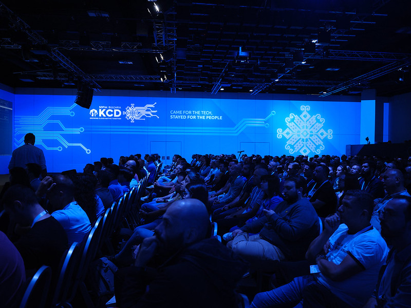

Welcome back to KCD Around the World, a series where we explore [Kubernetes Community Days](https://www.cncf.io/kcds/) from every corner of the globe. Behind every event is a community of volunteers, contributors, organizers and attendees who make it all happen. Through conversations with the people behind each KCD, we share what makes it unique.

This stop: Sofia, Bulgaria. On Tuesday, September 29, 2026, the second KCD Sofia takes place at Sofia Event Center. We spoke with three of its organizers, Yoana, Spas, and Orlin, about building a meeting point for Bulgaria's cloud native community and what goes into running it for a second year.

## Meet the community

**Kashish Verma (KV):** Could you each introduce yourselves and tell us how you got involved in Kubernetes?

**Yoana:** Hi, I'm Yoana, one of the KCD Sofia organizers. My background isn't purely technical. Most of my work has been about building technology communities and bringing companies, engineers, and people who care about the ecosystem together. At KCD Sofia, I look after partnerships, sponsors, communication, logistics, and coordination, basically everything that has to fall into place before the doors can open. What pulled me into the Kubernetes world was the community. You realize pretty quickly that it's not just about the technology, it's about people sharing what they know and building things together.

**Spas:** Hi, I'm Spas! I've worked with cloud native technologies for years, both in my day job and in the community, and I'm a CNCF Ambassador. For me, Kubernetes has always been about more than what it can do technically. It's the ecosystem around it that keeps me hooked: open source, collaboration, and people sharing knowledge. At KCD Sofia, I help shape the agenda and review talk topics, and I also work on the event concept and some of the visual and organizational details.

**Orlin:** Hey, I'm Orlin. I've been on the KCD Sofia team since the very first edition in 2025, and I end up doing a bit of everything, from planning and coordination to connecting all the moving parts. I've been part of the cloud native community since 2018 and a CNCF Ambassador since 2019. A few years ago, I also became the Community Manager for several CNCF projects, including Harbor, Contour, Velero, and K3s, so building community is literally my job now!

## Bringing a KCD to Sofia

**KV:** How did the idea for organizing this KCD come about?

**Orlin:** We wanted Bulgaria's cloud native community to have a proper place to meet. There are so many strong engineers and companies here working on Kubernetes, DevOps, platform engineering, cloud infrastructure, and open source, but there wasn't a community-driven event under the CNCF umbrella that brought them all into one room.

**Yoana:** And the first edition in 2025 proved the interest was real. We got a great response from attendees, speakers, and partners, which gave us the confidence to come back in 2026 and aim higher.

## The Sofia cloud native scene

**KV:** How would you describe the cloud native community in Sofia to our readers?

**Orlin:** I'd say active, curious, and growing up fast. Sofia has a strong engineering culture, and a lot of teams here are already running complex cloud native environments at scale.

**Spas:** What I love most is how diverse it is. You'll find engineers, architects, platform teams, DevOps folks, students, open source contributors, and tech leaders all in the same room. That mix leads to really interesting conversations and keeps the local scene exciting.

## What's new this year

**KV:** This is the second edition of KCD Sofia. What has changed since you first started?

**Orlin:** Honestly, a lot. Year one was about proving we could pull off something meaningful and that people actually wanted it. This year, we're more confident and a lot more ambitious. The team has more experience, our partner ecosystem is stronger, and we have a much clearer picture of what we want KCD Sofia to be.

**Spas:** We've also been more intentional about the agenda and the whole attendee experience. But we're careful to keep what worked last year: the open atmosphere, the accessibility, and that feeling that you're part of the event, not just sitting in the audience.

## Beyond the talks

**KV:** What's the logistics behind pulling off an event like this, and is the support out there helpful?

**Yoana:** The CNCF framework helps a lot. You get a structure, branding guidance, and the experience of KCDs all over the world to learn from. But the local work is still huge: venue, speakers, agenda, partners, contracts, invoices, booths, ticketing, communication, social media, video, signage, merch, catering, volunteers, and dozens of small decisions in between.

The audience sees one conference day. We live it for months.

**KV:** What do you think is the relevance of KCDs in the cloud native ecosystem?

**Orlin:** KCDs take the global cloud native ecosystem and make it local. Not everyone can travel to KubeCon, and there's huge value in meeting people nearby who are solving the same problems you are. KCDs give local engineers and contributors a stage, and they bring international experience into the local community too.

**Spas:** They also make the ecosystem much more approachable. You don't need to be an expert or a maintainer to come. You can show up because you're curious, because you're building something, or because you want to see where the industry is heading.

**KV:** Any challenges you weren't expecting?

**Yoana:** The sheer number of decisions! Some are obvious, like the venue, speakers, sponsors, and agenda. Others sound tiny until you actually have to deal with them: booth dimensions, T-shirts, badges, screens, deadlines, videos, printed materials, partner requirements, and all the last-minute changes.

The other big one is coordinating people. Speakers, sponsors, vendors, volunteers, and our own team all run on different timelines, so a lot of the job is just making sure everything lands at the right moment.

## This year's agenda

**KV:** Can you tell us more about this year's agenda?

**Spas:** We wanted the agenda to show how much broader cloud native has become. Kubernetes is still at the heart of it, but this year we're also covering platform engineering, AI, observability, DevOps, infrastructure, and the reality of running complex systems day to day.

We especially wanted practical talks, not just what worked but also what didn't, what teams learned, and what they'd do differently next time. We have a great mix of international and local speakers, including our keynote speaker William Rizzo, who brings a deep platform engineering perspective. The goal is simple: you should walk away with ideas you can actually use. You can see the full schedule on the [KCD Sofia agenda page](https://kcd.bg/agenda/).

**KV:** What would you like to highlight for our audience?

**Spas:** Come curious! You don't need to know everything about Kubernetes or platform engineering to enjoy KCD Sofia.

**Yoana:** The talks matter, of course, but so do the things you can't plan for: stumbling onto a topic you weren't looking for, meeting someone with a totally different perspective, or hearing how another team solved the exact problem you're stuck on. That's often the most valuable part of the day.

## Looking ahead

**KV:** Any final words for our readers?

**Yoana:** Organizing KCD Sofia is definitely not easy. It's months of planning, hundreds of messages, endless decisions and changes, and a lot of work nobody really sees.

**Orlin:** But then the doors open, the venue fills up, people start talking, learning, and sharing ideas, and suddenly it all makes sense. That's exactly why the three of us came back to do it again.

**Spas:** KCD Sofia 2026 is on Tuesday, September 29, at Sofia Event Center. Check out the [agenda](https://kcd.bg/agenda/) to see what's coming. We hope to see you there!

## Next stop...

KCD Around the World continues as we visit another community and learn about the people helping Kubernetes grow around the globe.