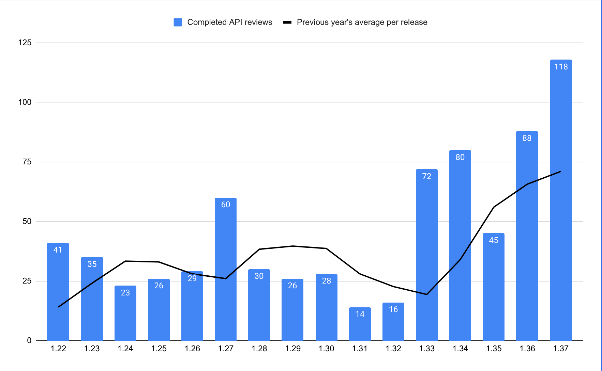
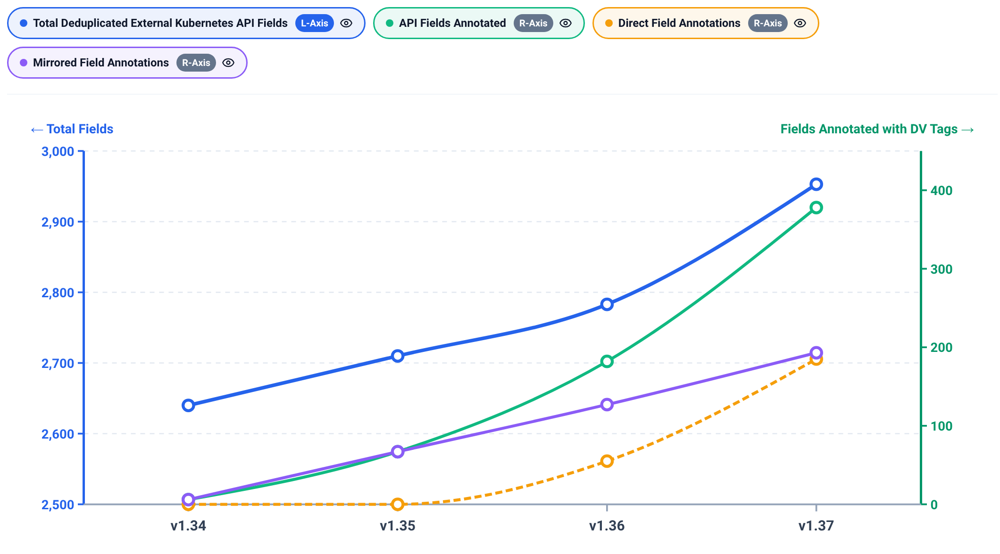

Kubernetes v1.37 saw the most API reviews in the project's history. API reviewers reviewed an all-time high of [118 PRs](https://docs.google.com/spreadsheets/u/0/d/1rVeszSQVl6K0am_mW83MhZNHMjSb88BBEEML8Cv_5Hg/edit), up from 88 in the v1.36 release.

Despite this massive surge, the API reviewers were able to keep pace. A primary driver of this efficiency was the significant expansion of Declarative Validation (DV), which [reached General Availability (GA)](https://kubernetes.io/blog/2026/05/05/kubernetes-v1-36-declarative-validation-ga/) in v1.36 and experienced its largest growth to date in v1.37. **Roughly 75% of new validations were written in DV, significantly saving reviewers' time.** Because the tooling handles the complexity, reviewers provided minimal guidance on the validation logic compared to previous releases.

Additionally, linters and other correctness checks were a major factor in maintaining this velocity. Pre-reviews conducted by Joel Speed ([@joelspeed](https://github.com/joelspeed)), Patrick Ohly ([@pohly](https://github.com/pohly)), Maciej Szulik ([@soltysh](https://github.com/soltysh)), Tim Allclair ([@tallclair](https://github.com/tallclair)), Joe Betz ([@jpbetz](https://github.com/jpbetz)), and Mo Khan ([@enj](https://github.com/enj)) saved a lot of time for our core API reviewers like Jordan and Tim. (A special congratulations to Joe, who was promoted to API approver this release!)

> *"The guardrail work that made use of declarative validation tags automatically require covering test cases made a big difference in 1.37. Validation expressed as declarative tags shrank the complexity of implementations and reviews, and is feeding a virtuous cycle where reviewers and authors prefer declarative validation once they get used to it. There were a few PRs this cycle that had almost no `validation.go` changes at all (🎉), and a lot where all the straightforward things were done declaratively and only a few complex things were checked in handwritten validation. This is exactly what I was hoping for."*
> — **Jordan Liggitt**

> *"Being able to write the validation rules right next to the type definitions means our APIs are much more likely to be correctly validated and are vastly easier to review. Lint rules now catch the most common mistakes, which means we can ship new features with higher confidence that we don't let bad data into the system. As a reviewer, this is gold."*
> — **Tim Hockin**



*This graph shows the number of completed API reviews by the API reviewers in a release with the rolling average since the beginning of the project.*

## Unprecedented DV Adoption and Growth

Whether an API author is building something from scratch or updating an existing type, the process is streamlined: new and existing types (including `PodSpec`) can now use declarative validations simply by adding the appropriate tags and corresponding tests.

The adoption metrics for Declarative Validation in v1.37 are staggering. Total de-duplicated API struct fields annotated with declarative validation grew from 182 in v1.36.0 to 378 at 1.37. This represents a **+107.7% growth** in unique field adoption.

All new APIs are heavily leveraging this capability. Out of the 206 DV adoptions, 150 are purely new fields, using declarative validations without corresponding handwritten validations.

[](https://docs.google.com/spreadsheets/d/1bt9xmx0OY3AgfyotO-u9jAqRZFvFRxqYbKUtllHxsJQ/edit?gid=397133469#gid=397133469)
*To view the underlying metrics, see the [Declarative Validation Adoption Spreadsheet](https://docs.google.com/spreadsheets/d/1bt9xmx0OY3AgfyotO-u9jAqRZFvFRxqYbKUtllHxsJQ/edit?gid=397133469#gid=397133469).*

To understand why this is such a powerful multiplier, consider how much simpler it is to write validation declaratively. Instead of writing and testing custom Go functions for standard rules, authors simply use structural tags:

**Declarative Validation (v1.37):**

```go
// +k8s:maxLength=64
// +k8s:optional
Name *string `json:"name,omitempty"`
```

**Legacy Handwritten Validation:**

```go
if obj.Name != nil && len(*obj.Name) > 64 {
    allErrs = append(allErrs, field.TooLong(field.NewPath("name"), *obj.Name, 64))
}
```

## Guardrails: Enforcing Correctness

A major focus for v1.37 was ensuring that a DV tag can no longer silently do nothing, or do the wrong thing. We implemented four enforced layers to close potential gaps:

1. **Layer 1 — Wiring:** A strategy opt-in sweep ensures that every registered strategy in the control plane declaratively opts into validation.
2. **Layer 2 — Fail-loud option declaration:** A fail-loud option declaration ensures that tags gated on a strategy option explicitly declare those options, turning silent failures into loud internal errors.
3. **Layer 3 — Coverage gate:** A per-Kind coverage gate now covers 2,322 declared rules across 144 GVKs, ensuring that adding a tag mechanically produces a declared rule that must be triggered by a test case to pass the build.
4. **Layer 4 — Cross-version equivalence:** A scheme-driven cross-version equivalence sweep compares declarative and handwritten errors by field, error type, and origin across feature-gate scenarios and all wire versions of a type.

## `validation-gen` Evolution

The code generator powering this feature, `validation-gen`, saw significant evolution. It introduced 6 net-new validation tags:
- `+k8s:customValidation`
- `+k8s:dependentRequired`
- `+k8s:dependentForbidden`
- `+k8s:monotonic`
- `+k8s:minProperties`
- `+k8s:maxProperties`

Currently, there are 31 stable [tags available](https://kubernetes.io/docs/reference/using-api/declarative-validation/#declarative-validation-tag-reference) to use. Whatever validations are supported by the CRD OpenAPI schema can now be done directly using these supported stable tags.

Furthermore, `validation-gen` was extended to support generating validation code out-of-tree (in repositories other than `kubernetes/kubernetes`), as well as supporting Go types generated from protobuf types. Introduced specifically for [agent-substrate](https://github.com/agent-substrate/substrate) (a CNCF project), these enhancements pave the way for even broader ecosystem compatibility.

For full documentation on how to use these tags and implement declarative validation in your own types, visit the [Declarative Validation documentation](https://kubernetes.io/docs/reference/using-api/declarative-validation/).


## Getting Involved

The migration to declarative validation is an ongoing effort. While the framework itself is GA, there is still work to be done migrating foundational APIs to the new declarative format.

If you are interested in contributing to the core of Kubernetes API Machinery, this is a fantastic place to start:
- Check out the `validation-gen` documentation.
- Look for issues tagged with [area/api-validation](https://github.com/kubernetes/kubernetes/issues?q=label%3Aarea%2Fapi-validation).
- Join the conversation in [#sig-api-machinery](https://kubernetes.slack.com/messages/sig-api-machinery) and [#sig-api-machinery-dev-tools](https://kubernetes.slack.com/messages/sig-api-machinery-dev-tools) on Kubernetes Slack (for an invitation, visit [slack.k8s.io](https://slack.k8s.io/)).
- Attend the [SIG API Machinery DV and KAL meetings](https://github.com/kubernetes/community/tree/master/sig-api-machinery#meetings) to get involved directly.

## Acknowledgments

A massive thank you to everyone who contributed to this monumental release. We'd like to extend special thanks to:

* **Our API Reviewers:** Tim Hockin ([@thockin](https://github.com/thockin)), Jordan Liggitt ([@liggitt](https://github.com/liggitt)), David Eads ([@deads2k](https://github.com/deads2k)), Joe Betz ([@jpbetz](https://github.com/jpbetz)), and Michelle Au ([@msau42](https://github.com/msau42)).
* **Our Pre-Reviewers:** Joel Speed ([@joelspeed](https://github.com/joelspeed)), Patrick Ohly ([@pohly](https://github.com/pohly)), Maciej Szulik ([@soltysh](https://github.com/soltysh)), Tim Allclair ([@tallclair](https://github.com/tallclair)), and Mo Khan ([@enj](https://github.com/enj)) for their tireless pre-review efforts.
* **The DV Working Group:** Lalit Chauhan ([@lalitc375](https://github.com/lalitc375)), Yongrui Lin ([@yongrlin](https://github.com/yongrlin)), Darshan Murthy ([@darshansreenivas](https://github.com/darshansreenivas)), Pranshul ([@pranshul](https://github.com/pranshul)), Joel Speed ([@joelspeed](https://github.com/joelspeed)), Bryce Palmer ([@everettraven](https://github.com/everettraven)), and many more.

Welcome to an even safer, more declarative future for Kubernetes!
