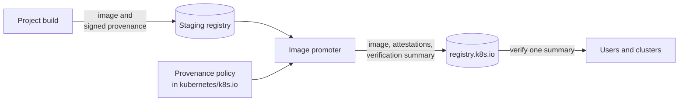
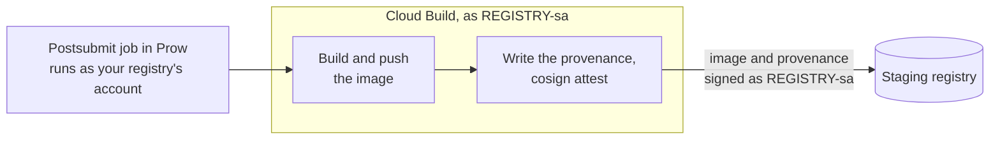
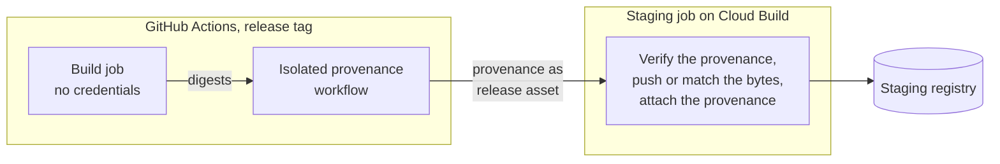

The Kubernetes community has been
[signing its container images](https://kubernetes.io/blog/2022/12/12/kubernetes-release-artifact-signing/)
since v1.24, and the images that
[`kpromo`](https://github.com/kubernetes-sigs/promo-tools), the Kubernetes
image promoter
([rewritten earlier this year](https://kubernetes.io/blog/2026/03/17/image-promoter-rewrite/)),
copies to `registry.k8s.io` get a signature. A signature answers one
question: did this image go through the official promotion process? It does
not answer the more interesting one: how was this image built, and from which
source?

Projects can attach signed [SLSA provenance](https://slsa.dev/spec/v1.0/provenance)
to their images to answer that. But to check it yourself, you have to know
who builds each image, which identity signs its provenance, which builder it
claims and which repository it comes from, for every project you pull from.
That is a lot to ask, and in practice few people do it.

Since October 2026, the image promoter does this work for you, once, at
promotion time, and publishes the answer as a signed
[SLSA verification summary](https://slsa.dev/spec/v1.0/verification_summary)
(VSA) for every image it promotes. In this blog post, I'd like to explain how
it works, how you can verify it, and how your project can get its images
verified at [SLSA build level](https://slsa.dev/spec/v1.0/levels) 1 or 3.

## How does it work?

A project declares a provenance policy in its promoter manifest in
[kubernetes/k8s.io](https://github.com/kubernetes/k8s.io): who may sign its
build attestations, which builders it trusts and at which level, and which
source repositories its images come from. When a reviewed pull request
promotes an image, the promoter evaluates the attestations of the staging
image against that policy with the
[SLSA verifier](https://github.com/slsa-framework/verifier), copies the
accepted attestations to `registry.k8s.io` and writes the summary:



The summaries are signed by a dedicated identity,
`promoter-summaries@k8s-releng-prod.iam.gserviceaccount.com`, which only the
production jobs of the image promoter can use. `registry.k8s.io` serves them
in every region as OCI referrers of the image, together with the carried
attestations and next to the image signature. Like the signatures, they are
stored once and every region routes to them, see
[Eliminating Kubernetes Image Signature Replication](https://www.kubernetes.dev/blog/2026/06/05/image-signature-routing/).

The [Security Profiles Operator](https://github.com/kubernetes-sigs/security-profiles-operator)
(SPO) is the first project using it: its
[v1.1.1](https://github.com/kubernetes-sigs/security-profiles-operator/releases/tag/v1.1.1)
operator images, `spoc` binaries and Helm chart verify at SLSA build
level 3.

## Verifying an image

You need [`cosign`](https://github.com/sigstore/cosign) v3 and `jq`, and for
the second check also
[`crane`](https://github.com/google/go-containerregistry/tree/main/cmd/crane)
and the SLSA verifier v0.1.0 from
[slsa-framework/verifier](https://github.com/slsa-framework/verifier/releases/tag/v0.1.0),
not to be confused with the older `slsa-framework/slsa-verifier`.

`cosign` checks the signer of the summary, and `jq` the verifier ID, the
result and the level:

```shell
cosign verify-attestation \
  --type https://slsa.dev/verification_summary/v1 \
  --certificate-identity promoter-summaries@k8s-releng-prod.iam.gserviceaccount.com \
  --certificate-oidc-issuer https://accounts.google.com \
  registry.k8s.io/security-profiles-operator/security-profiles-operator:v1.1.1 |
  jq -e '.payload | @base64d | fromjson | .predicate
    | select(.verifier.id == "https://k8s.io/promo-tools/verifier/v1")
    | .verificationResult == "PASSED"
      and any(.verifiedLevels[]; . == "SLSA_BUILD_LEVEL_3")'
```

If everything matches, `jq` prints `true`, otherwise it exits non-zero.

The SLSA verifier does the same on the downloaded summary and tells you what
it checked:

```shell
IMAGE=registry.k8s.io/security-profiles-operator/security-profiles-operator:v1.1.1
cosign download attestation \
  --predicate-type https://slsa.dev/verification_summary/v1 \
  "$IMAGE" > vsa.sigstore.json
slsa-verifier vsa \
  --verifier 'https://k8s.io/promo-tools/verifier/v1=sigstore::https://accounts.google.com::promoter-summaries@k8s-releng-prod.iam.gserviceaccount.com' \
  --level SLSA_BUILD_LEVEL_3 \
  --subject "$(crane digest "$IMAGE")" \
  vsa.sigstore.json
```

The output is similar to this:

```console
PASS
VSA: https://slsa.dev/verification_summary/v1

  Verifier:  https://k8s.io/promo-tools/verifier/v1 (signed by sigstore::https://accounts.google.com::promoter-summaries@k8s-releng-prod.iam.gserviceaccount.com)
  Result:    PASSED
  Resource:  registry.k8s.io/security-profiles-operator/security-profiles-operator@sha256:b110a24ae9d7dc22c1850b2b9598bd01a5047bd316d413066a9078691e844cef
  Policy:    git+https://github.com/kubernetes/k8s.io#registry.k8s.io/manifests/k8s-staging-sp-operator/promoter-manifest.yaml
  Levels:    SLSA_BUILD_LEVEL_3, K8S_PROMOTION_MANIFEST_REVIEWED

Subjects:
  [PASS]  sha256:b110a24ae9d7dc22…  matches registry.k8s.io/security-profiles-operator/security-profiles-operator

Checks:
  [PASS]  Result is PASSED
  [PASS]  Verifier == "https://k8s.io/promo-tools/verifier/v1"
  [PASS]  Signer is authorized for verifier "https://k8s.io/promo-tools/verifier/v1"
  [PASS]  verifiedLevels satisfies one of [SLSA_BUILD_LEVEL_3] (or higher per track)
```

What happens if we try the same for the SPO operator bundle? Set `IMAGE` to
`registry.k8s.io/security-profiles-operator/security-profiles-operator-bundle:v1.1.1`
and run the download and the verifier again. The v1.1.1 bundle was only
built on Cloud Build, which reaches level 1, so the level check fails (later
releases attest the bundle on GitHub as well):

```console
FAIL
…
Checks:
  [PASS]  Result is PASSED
  [PASS]  Verifier == "https://k8s.io/promo-tools/verifier/v1"
  [PASS]  Signer is authorized for verifier "https://k8s.io/promo-tools/verifier/v1"
  [FAIL]  verifiedLevels satisfies one of [SLSA_BUILD_LEVEL_3] (or higher per track)  verifiedLevels = [SLSA_BUILD_LEVEL_1 K8S_PROMOTION_MANIFEST_REVIEWED]
```

This is why you should always pin both the signer and the level. The
`verifier.id` is just a field of the summary, and only the signature of
`promoter-summaries` makes it the promoter's. `PASSED` alone only means that
the image was promoted from a reviewed promoter manifest: an image of a
project without a policy gets a passed summary with
`SLSA_BUILD_LEVEL_UNEVALUATED`, and an image that violated a policy in `warn`
mode gets `FAILED`.

Besides the level, the summary pins the commit of the promoter manifest it was
evaluated against (`policy.digest.gitCommit`), so you can look up exactly
which version of the policy the image passed.

The summary also lists the staging attestations the policy accepted, by
digest. The promoter copies them along, which covers every attestation signed
by one of the signers of the policy. SPO signs its SBOMs and VEX documents
with the same identity as its provenance, so they sit right next to the image
on `registry.k8s.io` as well:

```shell
cosign tree registry.k8s.io/security-profiles-operator/security-profiles-operator-amd64:v1.1.1
```

The output is similar to this:

```console
📦 Supply Chain Security Related artifacts for an image: registry.k8s.io/security-profiles-operator/security-profiles-operator-amd64:v1.1.1
└── 🔐 Signatures for an image tag: …:sha256-6777021c….sig
└── 🔗 https://sigstore.dev/cosign/sign/v1 artifacts via OCI referrer: …
└── 🔗 https://openvex.dev/ns artifacts via OCI referrer: …
└── 🔗 https://k8s.io/promo-tools/promotion/v1 artifacts via OCI referrer: …
└── 🔗 https://scorecard.dev/result/v0.1 artifacts via OCI referrer: …
└── 🔗 https://spdx.dev/Document artifacts via OCI referrer: …
└── 🔗 https://slsa.dev/verification_summary/v1 artifacts via OCI referrer: …
└── 🔗 https://in-toto.io/attestation/vulns/v0.2 artifacts via OCI referrer: …
└── 🔗 https://slsa.dev/provenance/v1 artifacts via OCI referrer: …
└── 🔗 https://slsa.dev/provenance/v1 artifacts via OCI referrer: …
└── 🔗 https://spdx.dev/Document artifacts via OCI referrer: …
└── 🔗 https://in-toto.io/attestation/build-env/v1 artifacts via OCI referrer: …
```

Two SLSA provenances? Yes: one from Cloud Build at level 1, and one from
GitHub Actions at level 3. The promoter reports the highest level that passes
the policy.

## What do the levels mean?

SLSA defines its build levels by what they protect against:

| Level | Requires | Protects against |
|-------|----------|------------------|
| 1 | Provenance exists, showing how the artifact was built | Mistakes, and it documents the build |
| 2 | The provenance is generated and signed by a hosted build platform | Tampering after the build |
| 3 | A hardened build platform, whose build steps cannot influence the provenance or reach its signing key | Tampering during the build |

The promoter only claims a level that the policy verified: the provenance has
to be signed by a trusted signer and name a builder that the policy trusts at
that level. Because the promoter attaches that level to the image, you can
decide per image what you accept, for example level 3 for an image that runs
privileged on every node, and level 1 for a test image.

You may notice that level 2 is missing in practice. Cloud Build can
[generate provenance](https://cloud.google.com/build/docs/securing-builds/generate-validate-build-provenance)
as a build platform, but stores it as Artifact Analysis metadata in Google
Cloud instead of attaching it to the image, where the promoter could pick it
up. So staging builds write their own provenance, which keeps them at level
1, while the isolated GitHub workflow reaches level 3 directly. Which brings
us to the question of how your project gets there.

## Getting your project verified

A project needs three things: signed provenance on its staging images, a
provenance policy in its promoter manifest, and a test run before it
promotes. For the build side, there are two routes:

| | Cloud Build | GitHub Actions |
|-|-|-|
| SLSA build level | 1 | 3 |
| Effort | one script in your staging build | an isolated provenance workflow plus a hand-over to staging |
| Good for | every image your staging build pushes | releases |

Both can be combined, like SPO does: everything gets attested at level 1 on
Cloud Build, and releases and its security profiles additionally at level 3
on GitHub.

### Cloud Build: SLSA build level 1

Every registry in the shared `k8s-staging-images` project comes with its own
build service account, usually
`<registry>-sa@k8s-staging-images.iam.gserviceaccount.com`, which the Prow
jobs of that registry run as. That account is your signing identity. If your
project still pushes to a staging project of its own, moving to
`k8s-staging-images` is the first step:



1. Run your staging build as that account: `serviceAccount:` in your
   `cloudbuild.yaml`, and in the image pushing job in
   [kubernetes/test-infra](https://github.com/kubernetes/test-infra/tree/master/config/jobs/image-pushing)
   `serviceAccountName: <registry>`. Until the shared `gcb-builder` account
   is retired, also add your registry to `skip_gcb_builder_shim` in
   [kubernetes/k8s.io](https://github.com/kubernetes/k8s.io/blob/main/infra/gcp/terraform/k8s-staging-images/registries.tf),
   so that no other build can act as your account.
2. After pushing, write a SLSA provenance predicate for each image digest and
   attach it:

   ```shell
   cosign attest --yes --type slsaprovenance1 --predicate provenance.json \
     us-central1-docker.pkg.dev/k8s-staging-images/<registry>/<image>@sha256:…
   ```

   cosign signs keyless as the service account of the build, no keys
   involved. The predicate should name a builder ID that includes the
   account, as well as the source repository and the commit. SPO's
   [`hack/attest-provenance.sh`](https://github.com/kubernetes-sigs/security-profiles-operator/blob/main/hack/attest-provenance.sh)
   is a complete example you can copy.
3. For a multi-architecture image, attest each platform image and not only
   the index: container runtimes pull the platform image, and the promoter
   evaluates it against its own attestations. If only the index is attested,
   the platform images get a summary without a build level.

Why only level 1? Well, the build writes and signs its own provenance. It
proves who built the image, but the build steps could have influenced what
the provenance says.

### GitHub Actions: SLSA build level 3

Level 3 needs provenance the build itself cannot forge. GitHub's
[`actions/attest-build-provenance`](https://github.com/actions/attest-build-provenance),
running in an isolated reusable workflow, provides exactly that. The catch:
GitHub Actions has no write access to the staging registries, so a staging
job has to hand the artifacts over:



1. Build without credentials and pass only the digests to a reusable
   provenance workflow, which is the only job with `id-token: write`. Its
   workflow file is the signing identity, so let it refuse to sign anything
   but your release tags, and allow only your release managers to create
   those tags by using a tag ruleset.
2. Publish the provenance bundle as a release asset.
3. A Cloud Build job, running as the same account as your staging build,
   verifies the bundle with cosign against your workflow identity and
   attaches it as an OCI referrer to the staging digest. That digest has to be the one GitHub attested: either the job
   pushes the artifact GitHub built byte for byte (SPO does this for `spoc`
   and the Helm chart), or your images are reproducible and Cloud Build
   pushed the very same digests (SPO does this for its container images).

The SPO [release documentation](https://github.com/kubernetes-sigs/security-profiles-operator/blob/main/doc/release.md#per-arch-images)
describes both hand-overs in detail, and its
[`provenance.yml`](https://github.com/kubernetes-sigs/security-profiles-operator/blob/main/.github/workflows/provenance.yml)
shows how the caller check works.

### Writing the policy

The last piece is the `provenance` section of your promoter manifest in
[kubernetes/k8s.io](https://github.com/kubernetes/k8s.io/tree/main/registry.k8s.io/manifests).
This is the policy of SPO, covering both routes. Its GitHub signer may also
sign at `main`, because SPO publishes its security profiles from `main`, and
`main` only changes through reviewed pull requests:

```yaml
provenance:
  mode: require
  signers:
  - sigstore::https://accounts.google.com::sp-operator-sa@k8s-staging-images.iam.gserviceaccount.com
  - sigstore(identityMatch=regex)::https://token.actions.githubusercontent.com::https://github\.com/kubernetes-sigs/security-profiles-operator/\.github/workflows/provenance\.yml@(refs/tags/v[0-9]+\.[0-9]+\.[0-9]+|refs/heads/main)
  builders:
  - id: https://cloudbuild.googleapis.com/projects/k8s-staging-images/serviceAccounts/sp-operator-sa@k8s-staging-images.iam.gserviceaccount.com/cloudbuild.yaml
    level: 1
  - id: https://github.com/kubernetes-sigs/security-profiles-operator/.github/workflows/provenance.yml
    level: 3
    signers:
    - sigstore(identityMatch=regex)::https://token.actions.githubusercontent.com::https://github\.com/kubernetes-sigs/security-profiles-operator/\.github/workflows/provenance\.yml@(refs/tags/v[0-9]+\.[0-9]+\.[0-9]+|refs/heads/main)
  sources:
  - github.com/kubernetes-sigs/security-profiles-operator
```

The `signers` define who may sign your attestations. Each builder gets the
level it may claim, and binding the GitHub builder to its own signer ensures
that the Cloud Build account cannot claim level 3.

The `mode` decides what happens to an image that violates the policy:
`require` blocks its promotion, `warn` promotes it with a `FAILED` summary and
logs why, and `off` (the default) disables the policy.

Rolling it out works like this:

1. Start with `mode: warn`.
2. Test it with a dry run, `kpromo cip --thin-manifest-dir=<dir>`, on a
   directory with only the manifests of your project and the digests you are
   about to promote. It logs the policy result of every new digest and
   changes nothing.
3. Promote as usual and verify the summary as shown above.
4. Switch to `mode: require`. From then on, an image that violates the
   policy fails the whole promotion run it is part of, until the digest is
   fixed or removed from the manifest.

The [promoter guide](https://github.com/kubernetes-sigs/promo-tools/blob/main/docs/verification-summaries.md)
walks through these steps, and
[provenance policies](https://github.com/kubernetes-sigs/promo-tools/blob/main/docs/image-promotion.md#provenance-policies)
describes every field.

## Things to keep in mind

There are a few corner cases worth knowing about. First, a digest gets its
summary once, when it is promoted, and keeps it forever. A policy added later
does not change it, so add the policy **before** you promote the images you
want to be summarized.

Second, most images promoted before October 2026 have no summary at all. A
consumer that requires a summary will reject them, so roll out such a
requirement in a logging mode first.

Third, a multi-architecture image is only as good as its platform images.
The promoter evaluates every platform image against its own attestations, and
a manifest list without provenance of its own gets the lowest level of its
platform images.

And finally, a summary is only useful if something checks it. The commands
above are fine for a one-off check, while in a cluster any tool that verifies
Sigstore attestations can require the summary. One example is
[nri-supply-chain](https://github.com/saschagrunert/nri-supply-chain), an
[NRI](https://github.com/containerd/nri) plugin for CRI-O and containerd,
which verifies images before the runtime creates a container. The
[SPO verification guide](https://github.com/kubernetes-sigs/security-profiles-operator/blob/main/doc/verification.md)
contains a complete rule for it.

## What comes next

We'd like to bring the same summaries to files and other OCI artifacts by
promoting them on the same pipeline
([Phase 4](https://github.com/kubernetes-sigs/promo-tools/milestone/5)), so
that files get verified like images.

The official Kubernetes images are next in line: the release tooling will
attest the provenance of the images it stages, so that the promoter verifies
them like those of any other project. The release binaries will follow
further down the road. The plan, including SLSA build level 3 for Kubernetes
releases, is tracked in
[kubernetes/release#2616](https://github.com/kubernetes/release/issues/2616).

Policies are getting stricter as well: required levels per image
([#2012](https://github.com/kubernetes-sigs/promo-tools/issues/2012)) are
merged for the next promoter release, and constraints on how a builder's
provenance was produced
([#2011](https://github.com/kubernetes-sigs/promo-tools/issues/2011)) are
in progress.

Most of all, we'd like to see more projects adopting it. If you maintain
images on `registry.k8s.io`, add a policy and let us know what got in your
way. The overall effort is tracked in
[promo-tools#1972](https://github.com/kubernetes-sigs/promo-tools/issues/1972).

## Thank you

Thanks to [Adolfo García Veytia](https://github.com/puerco) for steering this
work toward the SLSA verifier and the OpenSSF policy tooling instead of
another homegrown verifier, to [Mahamed Ali](https://github.com/upodroid) for
the infrastructure and identity work in SIG K8s Infra, and to the
[Release Engineering](https://github.com/kubernetes/sig-release/tree/master/release-engineering)
subproject of SIG Release for reviewing the changes and this post.

Thank you for reading this blog post! If you're interested in more, want to
provide feedback or need help with the policy of your project, then feel free
to get in touch with us via
[`#release-management`](https://kubernetes.slack.com/messages/release-management)
on the Kubernetes Slack.
