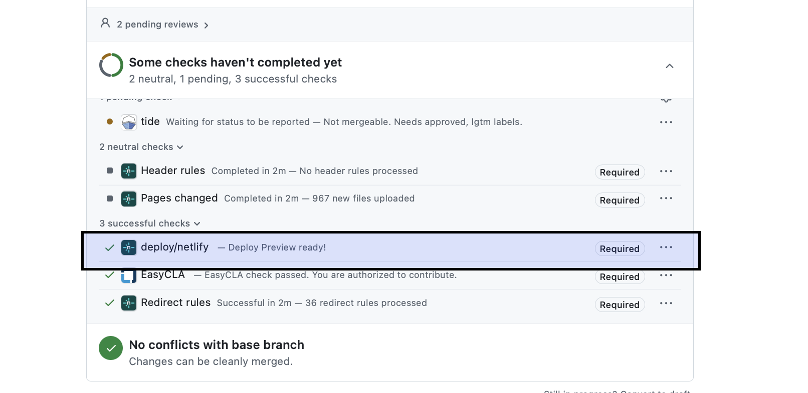

When I joined the Kubernetes blog team, I did not know quite what to expect.
Here is everything I picked up along the way from finding your first PR
to getting an article published. Everyone starts somewhere and I am glad you are starting here.

Before I get into it, let me answer the question I had when I first joined.

## Am I actually qualified to do this?

Yes. Genuinely.

You do not need years of Kubernetes experience to do this well. Curiosity
and being keen will take you further than you think. The more you review,
the more natural it feels. Everyone on this team had a first review. It
went fine. Yours will too.

## Where to find blogs to review?

Blog PRs are spread across two repositories depending on where they will
be published. Here is where to find them:

- [Open blog PRs on k/website](https://github.com/kubernetes/website/pulls?q=is%3Aopen+is%3Apr+label%3Aarea%2Fblog)
- [Open PRs on k/contributor-site](https://github.com/kubernetes/contributor-site/pulls)

*Yay, just pick one and go for it!*

## What we do not publish?

Before you invest real time in a review, please spend two minutes here:

- [What we do not publish](https://kubernetes.io/docs/contribute/blog/guidelines/#what-we-do-not-publish)

Not everything that comes in is a fit, so it is worth a quick check before
you go deep. And if you are ever not sure, just ask the team *(it is OK to ask)*!

## How do I know what a good blog looks like?

The standards are already set. There are proper guidelines for this,
please read them before you start reviewing:

- [Blog guidelines](https://kubernetes.io/docs/contribute/blog/guidelines/)
- [Style guide](https://kubernetes.io/docs/contribute/style/style-guide/)

Blogs use the same style guide as docs but blogs are not docs, so there
are some exceptions. Have a look at them as well:

- [Blog-specific exceptions](https://kubernetes.io/docs/contribute/blog/article-submission/#article-content)

*I know it's a lot to take in at once,and that's okay. Start with one thing,
maybe punctuation or formatting, and go from there. You will naturally
get faster over time.*

## The details that are easy to miss

This is the part I really want you to slow down on. These are the small things that quietly delay publication.

Every blog goes through **two stages**. First it gets merged as a draft.
Then, in a separate PR, it gets published. So, these are the few things I want you to treat as a pre-merge checklist. *(Trust me it really helped me, and I hope it helps you too.)*

### Is your front matter correct?

Most of the time, when a blog does not go out on time, it is a front
matter issue. Please take your time here:

```
---
layout: blog
title: "Your Title Here"
draft: true # will be changed to date: YYYY-MM-DD before publication
slug: lowercase-text-for-link-goes-here-no-spaces # optional
author: >
  Author-1 (Affiliation),
  Author-2 (Affiliation),
  Author-3 (Affiliation)
---
```

While you are reviewing a draft PR, the front matter should always have
`draft: true`. The `date: YYYY-MM-DD` field comes later, in a separate
publish PR *(which we discuss later)*. Hugo, the static site generator, will not publish anything until the date is set.

*So the draft needs to be merged first to move to the second stage for
setting the date.*

### Does the filename match the slug?

Quick one. If the front matter says `slug: demo-blog`, the file must be
called `demo-blog.md`.

### Is the author listed correctly?

If the author is not affiliated to any organization, it is either just
their name, or `Name (independent)`. Lowercase "i" on independent.

### Which site does the blog go on?

The blog publishes to one or both of these two sites:

- [kubernetes.io](https://kubernetes.io) : the main Kubernetes blog, stored in the [k/website GitHub repo](https://github.com/kubernetes/website/)
- [kubernetes.dev](https://www.kubernetes.dev) : the contributor blog, stored in the [k/contributor-site GitHub repo](https://github.com/kubernetes/contributor-site/)

If you want to know the difference between the content that gets published
to each site, check this out:

- [Content examples: kubernetes.io vs kubernetes.dev](https://kubernetes.io/docs/contribute/blog/guidelines/#content-examples)

If you think that the scope of a blog is not relevant to that site, feel
free to suggest. 

## How do I preview before merging?

When a PR is opened, Netlify, a web hosting platform, automatically builds
a preview. Here is how to find it:

- Scroll down in the PR to find the Netlify bot comment
- Click the "Deploy Preview" link, this won't take you directly to your blog post, so manually add `/blog/1/01/01/{slug}` to the URL, replacing ``{slug}`` with the blog's actual slug from the front matter.
- for example: `https://deploy-preview-kubernetes-io-main-staging.netlify.app/blog/1/01/01/my-blog-slug`



Hugo uses `1-01-01` as its default when no publish date is set yet.

**ALWAYS CHECK ON MOBILE TOO**

Something that looks great on desktop may not render properly on mobile.
Especially check for diagrams, math, and images.

## How do I merge and publish?

Once the draft is reviewed and ready, there are two paths depending on
where the article is being published.

### Going to one site

1. Merge the draft PR. The`draft: true` should still be in the front matter
   at this point.

### Going to both sites

If the team decides an article belongs on both k/website and
k/contributor-site:

1. Merge the draft in `k/contributor-site` first.
2. Open a [mirror](https://kubernetes.io/docs/contribute/blog/article-mirroring/) draft PR in `k/website`. The content needs to match exactly. No drift between the two versions.

### What to do once the draft is merged?

This is the last stage! A publish PR gets opened. All it does is take the same content and swap `draft: true` for `date: YYYY-MM-DD`. If the article is mirrored, make sure the date is the same for both sites and add`canonicalUrl` to the k/website front matter:

```yaml
canonicalUrl: https://www.kubernetes.dev/blog/{YYYY}/{MM}/{DD}/{slug}
```

Replace `{YYYY}`, `{MM}`, `{DD}`, and `{slug}` with the actual values.

*Now how is the publication date assigned?* To open the publish PR, one has to jump on [#sig-docs-blog](https://kubernetes.slack.com/archives/CJDHVD54J) channel to discuss the publication date with the other blog editors. The team confirms the date, suggest a change if needed, and once everyone is aligned , a publish PR can be created *(It's that easy!)*

One thing to keep in mind though, keep the publish PR small. Do not bundle in content changes. The smaller the PR, the easier it is to track, review, and fix if something goes wrong.

*Yayy! You are done, congratulations!* 

## How do I speed up the back and forth?

This is something I picked up early on and it helps a lot. If an author is
open to it, suggest they share their draft on HackMD or Google Docs before
opening a PR. Reviewing there means no waiting on commits for every small
change. You can send them a quick Slack message or reach out in the channel.

## Be kind

**This one really matters.**

The person who wrote that draft put real effort into it. They cared enough
to contribute to open source, to share something with the community. That
deserves respect, especially when leaving feedback.

When something needs attention:

- Help the author see the problem. Do not just flag it, explain it.
- If a piece feels borderline or a decision feels too big to make alone,
  bring it to the team. *(That is what the team is here for.)*

## It is OK to ask!

No question is too small. If something feels unclear, you are hesitant,
or just not sure, ask. The team is here for exactly that.

Start getting comfortable discussing in public channels. The conversations
you have in the open help others who have the same question later, and you
will connect with more people.

*That said, it comes with a small responsibility. We all need to be
respectful of each other and the first rule of respect is valuing
people's time. Do your research first, try to find the answer, and if
you cannot, then ask.*

## Come find us

The best thing I did when I joined was connect with the people around me.
It really does make a difference when you know the people you are working
with and they know you as well.

A good tip would be to start attending meetings and introducing yourself
to your colleagues. :)

**Slack:** [Join here](https://communityinviter.com/apps/kubernetes/community), then look for the [#sig-docs-blog](https://kubernetes.slack.com/archives/CJDHVD54J) channel.

**Meetings:** Join the biweekly [sig-docs meeting](https://docs.google.com/document/d/1emuO4nmaQq3K8JZ9-MQeIygtrCPO9kWv7U7RzTaW4F8/edit?tab=t.0#heading=h.1uet0y7duzt7), Tuesdays at 17:30 UTC.

If you are interested in exploring other SIGs, the [community groups page](https://www.kubernetes.dev/community/community-groups/)
has all the SIGs, their schedules, and how to join.


*I am glad you read through up until here and I hope it gave you
confidence to start.*